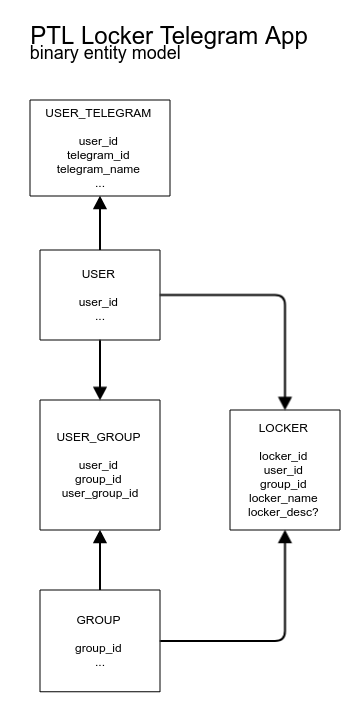
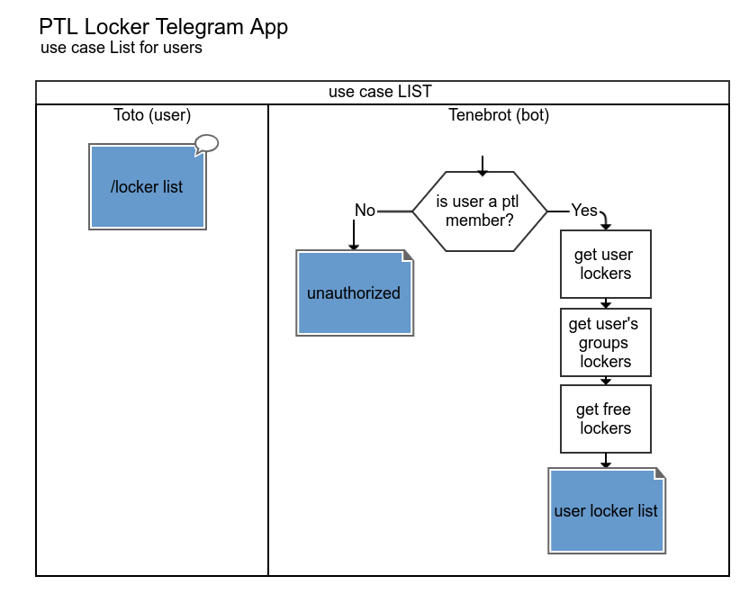
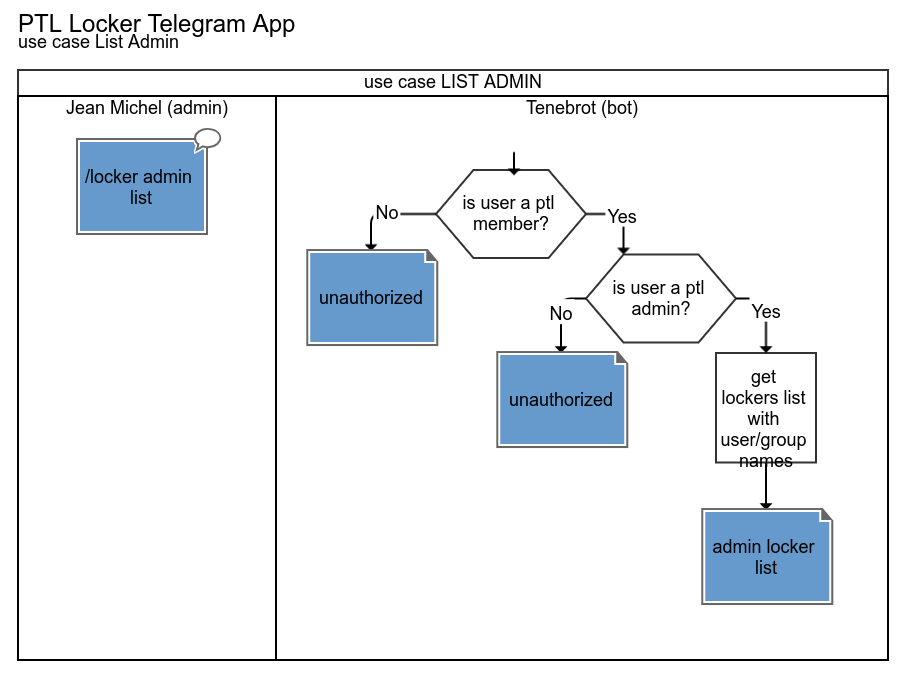
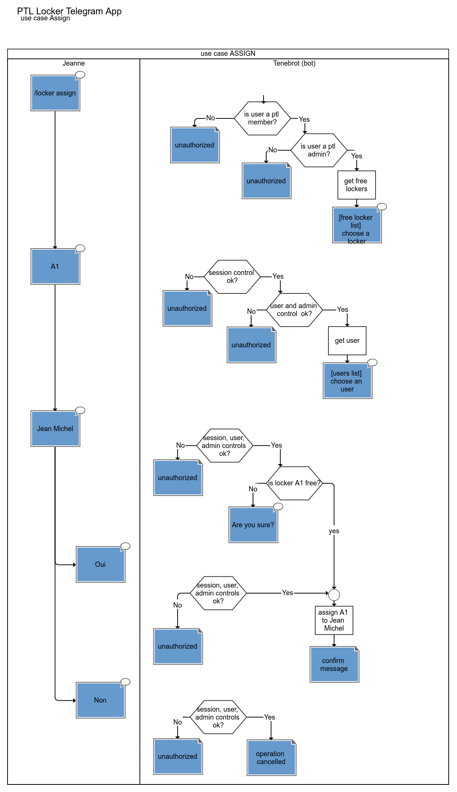

# PTL Locker Telegram App - Doc

## Entity model

Binary model

## Use Cases

### /locker list

for users, list of:

- personal lockers,
- lockers assigned to groups they belong,
- free lockers.

### /locker admin list

for admins, list of all lockers with the name of the user or groups they are assigned to.

### /locker assign

for admin, assign a locker to a user.

### /locker free

for admins only
deassign a locker

### /locker open

for users
list of own lockers
choice of locker
open the given locker

### /locker admin open

for admins
list of all lockers
choice of locker
open the given locker

### /locker

aka /locker help

brief description of the app

list of possible command (different for users and admins)

## Security

match Telegram Id with the one on USER_TELEGRAM table

session management ?

## Stack

nodejs

sqlite orm?

telegram api for nodejs

Typescript
